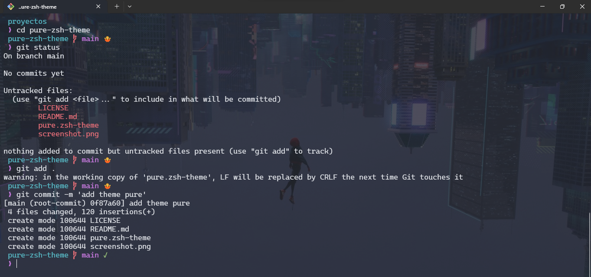

# pure-zsh-theme

un tema para oh-my-zsh.

## Introduction

## instalación

1.  En tu terminal escribe lo siguiente:`git clone git@github.com:cruzrovira/pure-zsh-theme.git`
2.  Abre tu configuración de `.zshrc`
3.  agrege una fuente de [Nerd Font](https://www.nerdfonts.com/) a su terminal
4.  cambia el valor `ZSH_THEME` por _`pure-zsh-theme/pure`_

REF: [Oh-My-Zsh External themes](https://github.com/ohmyzsh/ohmyzsh/wiki/External-themes)

### License

pure-zsh-theme se libera bajo la licencia [MIT License](https://opensource.org/licenses/MIT).
